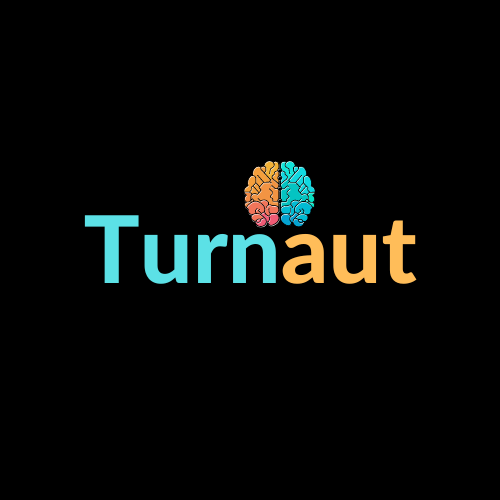

# Turnaut(co-teacher)
AI-Enhanced Teaching Assistant: Empowering Teachers with Personalized Learning

**Introduction**

Welcome to AI-Enhanced Sayansi, a cutting-edge educational platform designed to empower teachers with the latest AI-powered tools for data science and robotics education. Our platform goes beyond traditional online learning by incorporating artificial intelligence to evaluate student performance and provide personalized suggestions to enhance student engagement. Additionally, our AI-powered language models enable teachers to customize lessons and quizzes, tailoring the learning experience to meet the unique needs of each student.

**Who is this platform for?**
AI-Enhanced Sayansi is designed for teachers of all levels, from kindergarten to high school. Whether you are an experienced educator or a new teacher looking to harness the power of AI in education, our platform offers comprehensive resources to support your teaching journey. The courses are self-paced and can be completed at the teacher's own pace.

**What are the benefits of using this platform?**

There are many benefits to using this platform, including:
* AI-Powered Student Evaluation: With the help of advanced AI algorithms, Sayansi provides teachers with accurate and timely insights into student performance. These evaluations help identify areas where students may be struggling, allowing teachers to intervene proactively and provide personalized support.
* Personalized Engagement Strategies: Leveraging AI recommendations, teachers receive valuable insights into how to better engage with each student. This personalized approach fosters a more supportive learning environment, increasing student motivation and overall success.
* Customizable Lessons and Quizzes: Our AI-powered language models enable teachers to create custom lessons and quizzes that align with their teaching objectives and the unique needs of their students. This flexibility enhances the learning experience and ensures that lessons cater to individual learning styles.
* Enhanced Teacher Efficiency: AI algorithms streamline administrative tasks, allowing teachers to focus more on student interaction and teaching. Grading, performance tracking, and lesson planning become more efficient, giving educators the time to focus on what matters most – their students' growth

**How to get started**

    1. Sign Up: Create a free account on AI-Enhanced Sayansi to unlock the power of AI in your teaching journey.

    2. AI-Powered Insights: As you use the platform to interact with students, our AI algorithms will generate valuable insights into their performance and engagement levels.

    3. Personalized Recommendations: Based on the AI-generated data, receive personalized suggestions on how to optimize your teaching approach and enhance student engagement.

    4. Customizable Learning Materials: Utilize our AI-powered language models to tailor your lessons and quizzes, ensuring an optimized learning experience for each student.
    
**Pricing**

AI-Enhanced Sayansi offers a free basic plan that includes access to AI-powered student evaluation and basic customization features. For educators seeking more advanced capabilities, we offer a premium subscription option at a competitive price. The premium subscription grants access to enhanced AI insights and advanced customization tools.

**Conclusion**
We hope to revolutionize the education space by leveraging the power of AI.

AI-Enhanced Sayansi revolutionizes education by empowering teachers with AI-driven tools for personalized learning experiences. Embrace the future of education and join our community of educators who are making a positive impact on student success. Together, let's harness the power of AI to shape a brighter and more engaging educational landscape. Get started with AI-Enhanced Turnaut today and witness the transformative power of AI in education.

